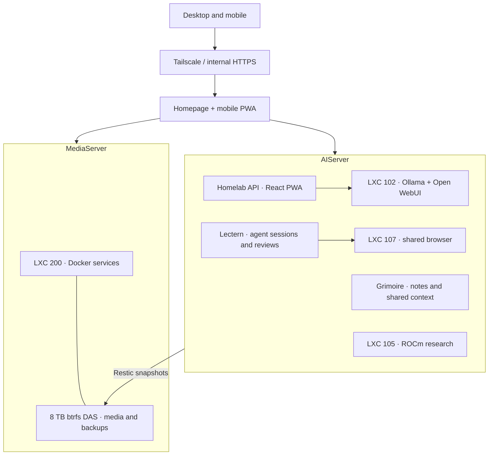

# Homelab Blueprint

A two-node Proxmox homelab running media automation, local AI, agent workspaces,
and self-hosted productivity tools on consumer hardware.

This repo documents the architecture, services, and lessons learned. No
credentials or private account data — just the blueprint.

**Current-state audit: September 25, 2026.** Inventory was checked against
Proxmox, running Docker containers, service APIs, and the dashboard. Resource
sizes below are a snapshot; live configuration remains authoritative.

## Cluster Overview

The old `pve` gaming node was sold in June 2026. Its Bazzite VM and automatic
Steam/game-streaming pipeline are retired. The game library services remain.
The [gaming notes](docs/gaming-vm.md) and [pipeline notes](docs/game-pipeline.md)
are retained as historical references, not the current architecture.

## Hardware

| Node | CPU | Cores / threads | RAM available to host | GPU | Role |
|------|-----|-----------------|-----------------------|-----|------|
| **MediaServer** | AMD Ryzen 7 8845HS | 8 / 16 | ~28 GiB | Radeon 780M | Docker services, media, backups |
| **AIServer** | AMD Ryzen AI MAX+ 395 | 16 / 32 | ~123 GiB | Radeon 8060S | Local inference, research, agents, development |

AIServer has 128 GB installed; available host memory differs from the advertised
capacity. The iGPU is shared with inference and research LXCs through `/dev/dri`
and `/dev/kfd`.

### Storage

- **Media:** an 8 TB btrfs DAS attached to MediaServer, mounted at `/mnt/storage`
  and passed into LXC 200. `/data/media` resolves to the media tree there.
- **AIServer root:** a fixed ~112 GiB linear LV. Guest thin-pool free space cannot
  simply be assigned to it.
- **Bulk:** a 600 GiB thin LV at `/mnt/bulk` for large projects, caches and
  recovery data. Monitor the backing thin pool as well as filesystem usage.
- **Backups:** nightly encrypted Restic snapshots on the DAS, plus a separate
  cold archive without automatic expiry. Restore checks are part of operations.

See [Disaster Recovery](docs/disaster-recovery.md) for coverage and limitations.

## Guests

| VMID | Guest | Node | Resources | Purpose / audit state |
|------|-------|------|-----------|-----------------------|
| 100 | media-monitor | AIServer | 4 cores / 8 GiB / 20 GiB disk | Homelab Agent; hostname is historical |
| 101 | project-env | AIServer | 4 cores / 4 GiB / 30 GiB | Development workspace |
| 102 | openclaw | AIServer | 16 cores / 44 GiB / 140 GiB | Ollama + Open WebUI, shared AMD GPU |
| 103 | valheim | AIServer | 4 cores / 6 GiB / 20 GiB | Dedicated game server; stopped at audit |
| 104 | work-env | AIServer | 4 cores / 4 GiB / 400 GiB | Development tools and Docker |
| 105 | research-env | AIServer | No core cap / 32 GiB / 500 GiB | ROCm research, shared AMD GPU |
| 106 | globality-dev | AIServer | 8 cores / 16 GiB / 60 GiB | Interview/development workspace |
| 107 | agent-desk | AIServer | 4 cores / 6 GiB / 24 GiB | Persistent browser + virtual desktop |
| 110 | adk-sandbox-tmpl | AIServer | 4 cores / 4 GiB / 30 GiB | Stopped Lectern clone template |
| 200 | docker-server | MediaServer | 12 cores / 24 GiB / 400 GiB | Main Docker host |

All listed guests are LXCs. A stopped experimental desktop VM is also retained;
it is not a required part of the service stack. Guest IDs can be reused: current
LXC 103 is **not** the old gaming VM, and LXC 106 is **not** the old AI detector.

## Everyday Access

**Homepage** is the desktop launcher, with four tabs:

| Tab | Contents |
|-----|----------|
| Overview | Quick access, host health, filesystem space, backups, tests, VPN and plan usage |
| Media | Libraries, requests, downloads, books and game collections |
| Tools | Notes, files, job search, AI, automation and productivity |
| System | Infrastructure, terminals, Proxmox and detailed stats |

The **React mobile PWA** provides service links, files, media, chat, activity,
terminal access, job tools and system information. It uses a tailnet HTTPS
origin so installation, service workers and share targets work on phones.

- **Grimoire:** notes, retrieval, shared agent context and credential grants.
- **Lectern:** agent sessions, tasks, review, approvals and the autonomous workshop.
- **Agent Desk:** one persistent browser that both the user and agents can see.
- **Capture:** links and notes go to Grimoire, files to Seafile, documents to Paperless.
- **Formwork:** job-search workspace and reviewable applications.

See [Dashboard](docs/dashboard.md) for layout, link rules and maintenance.

## Network

Hosts and guests use DHCP; stable inter-service addresses come from Tailscale
or MagicDNS. LAN addresses are configuration, not constants copied into apps.
LXC 200 and the managed switch have DHCP reservations.

- **Internal browser access:** nginx + Authelia at `*.homelab.internal`, with
  a local certificate authority.
- **Mobile access:** tailnet-only HTTPS with a publicly trusted certificate.
- **Public access:** only services explicitly configured in the Cloudflare tunnel.
- **Downloads:** qBittorrent, Librarr and Gamarr share Gluetun's Mullvad namespace.
- **Quorum:** a two-node cluster needs both votes; plan a QDevice if independent
  node maintenance is required.

[Networking](docs/networking.md) covers DNS, auth boundaries and iframe origins.

## AI & Automation

Local inference runs on Ollama in LXC 102. The Homelab API routes tools, calls
services and streams results to the PWA and Homepage; Discord has a restricted
surface. A separate Homelab Agent in LXC 100 monitors and repairs the estate.

The stack includes semantic tool routing, episodic memory, LLM traces, document
retrieval, a constrained code sandbox, and escalation to coding agents. Grimoire
provides shared context; Doc RAG indexes documents, service catalogs and project
configuration. Model upgrades are tested against actual tool-use scenarios.

There is no blanket “10/10” reliability claim: old tiny prompt sets did not
measure the range of real tasks. The current capability harness grades outcomes
in a simulated homelab, separately reports safety violations, and requires
repeated runs for model comparisons.

Details: [AI Stack](docs/ai-stack.md), [Automation](docs/automation.md),
[Monitoring](docs/monitoring.md).

## Documentation & Examples

| Document | Contents |
|----------|----------|
| [Docker Services](docs/docker-services.md) | Current media, productivity and infrastructure services |
| [Media Stack](docs/media-stack.md) | Requests, downloads, imports and libraries |
| [Dashboard](docs/dashboard.md) | Desktop/mobile entry points and refresh procedure |
| [AI Stack](docs/ai-stack.md) | Local models, agents, context and evaluation |
| [Automation](docs/automation.md) | Watchdogs, repair, capture and backups |
| [Monitoring](docs/monitoring.md) | Metrics, health checks and known blind spots |
| [Networking](docs/networking.md) | DHCP, Tailscale, VPN, DNS and HTTPS |
| [Disaster Recovery](docs/disaster-recovery.md) | Recovery order, archive policy and restore verification |
| [Lessons Learned](docs/lessons-learned.md) | Debugging notes and operational lessons |
| [Terraform](terraform/) | Container shell examples; not a full recovery system |
| [Ansible](ansible/) | Earlier provisioning scaffold; coverage and limitations documented |
| [Compose example](docker-compose.example.yml) | Selected Docker patterns; not an export of production |

Templates are deliberately sanitized. Review them against your own hardware,
authentication and storage before running them. None of these files contains
production Terraform state or private service credentials.

## Open Source Projects

| Project | Purpose |
|---------|---------|
| [Librarr](https://github.com/JeremiahM37/librarr) | Books, audiobooks and manga |
| [Sentinel](https://github.com/JeremiahM37/sentinel) | Download tracking and library verification |
| [Gamarr](https://github.com/JeremiahM37/gamarr) | Game and ROM libraries |
| [Grimoire](https://github.com/JeremiahM37/grimoire) | Personal context server |
| [Lectern](https://github.com/JeremiahM37/lectern) | Agent mission control, formerly AgentDeck |
| [Formwork](https://github.com/JeremiahM37/formwork) | Reviewable job applications |
| [homelab-ai](https://github.com/JeremiahM37/homelab-ai) | Public monitoring/orchestration package; distinct from the private deployment |
| [gpu-graph-mcp](https://github.com/JeremiahM37/gpu-graph-mcp) | GPU state over MCP |
| [mttyd](https://github.com/JeremiahM37/mttyd) | Mobile terminal wrapper |
| [pocketlab](https://github.com/JeremiahM37/pocketlab) | Portable mobile dashboard |
| [verify](https://github.com/JeremiahM37/verify) | Tests, endpoint checks and browser verification |
| [strix-halo-sglang](https://github.com/JeremiahM37/strix-halo-sglang) | Inference experiments on AMD Strix Halo |

## License

MIT — use this as inspiration for your own homelab.
